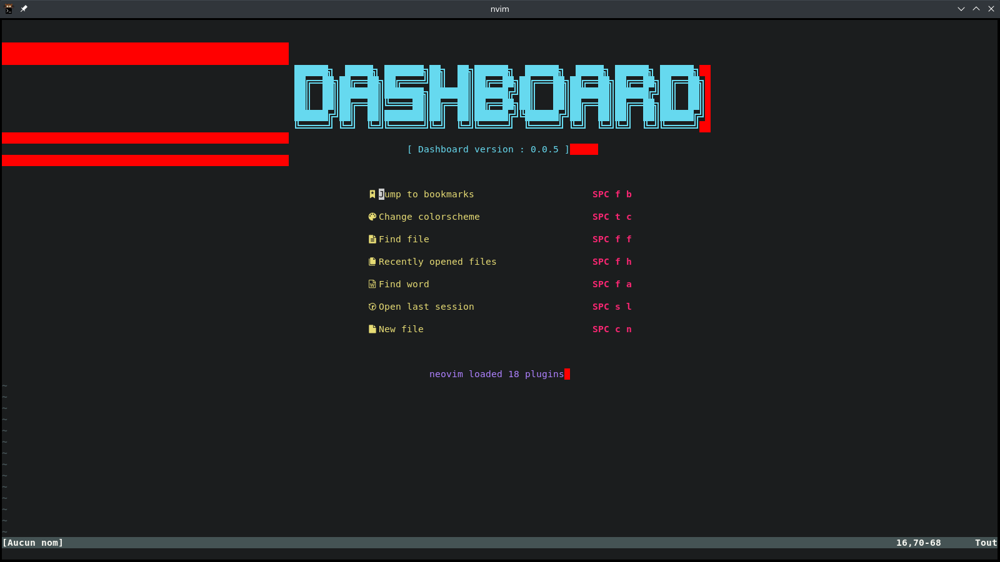
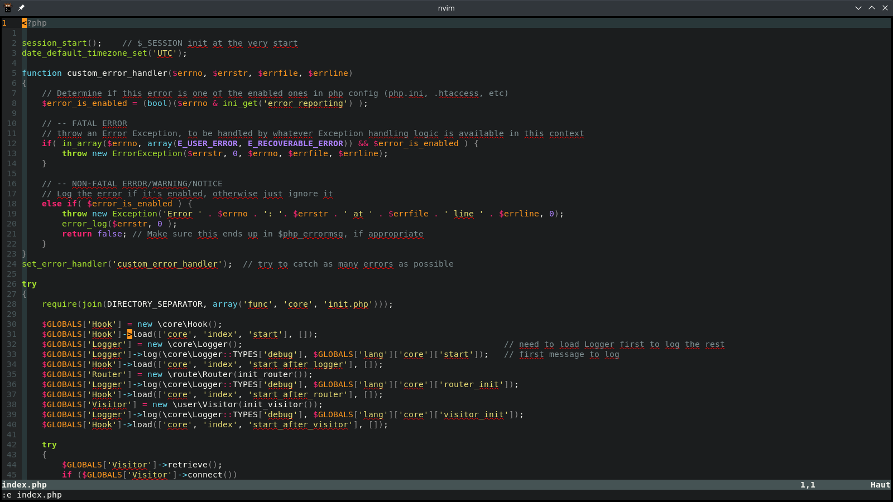
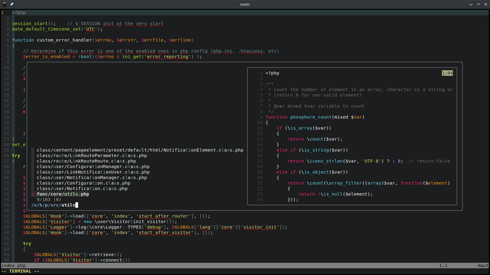

# neovim dotfiles
Configuration files for [neovim](https://neovim.io).

## requirement
- [fzf](https://github.com/junegunn/fzf)
- [grammalecte](https://grammalecte.net)
- [exuberant ctags](https://ctags.sourceforge.net)
- [git](https://git-scm.com)

## screenshot

